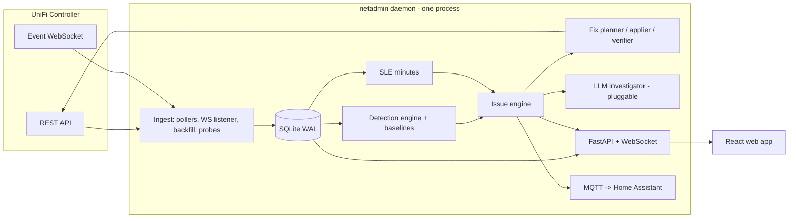

# UnifiOptimizer Rebuild — Architecture

**Status:** approved plan, branch `rebuild/core`
**Date:** 2026-07-21
**Role split:** Fable architects and reviews; Opus workers (effort high/xhigh) implement via Workflow phases.

## 1. What this is

A ground-up rebuild of UnifiOptimizer's core around one idea: the tool behaves like a network admin, not a report generator. A network admin remembers. They notice a port started throwing errors on Tuesday, watch it for a day, conclude the cable is bad, tell you, and check their fix actually held. The current codebase cannot do any of that because every run is a stateless snapshot. This rebuild adds the missing spine: a local time-series store, a continuous collector, detectors with confounder checks, and an issue-lifecycle engine that tracks every finding from first sighting to verified fix.

Product decisions already made (see `memory/product-vision-and-decisions.md`):

1. Two runtime modes, one engine: an always-on daemon, plus the existing on-demand "tech visit" mode.
2. Deterministic detectors, with a pluggable LLM investigator on top (manual markdown exchange, GitHub Copilot CLI, or Anthropic API; no key required for v1).
3. Greenfield core in a new `netadmin/` package; proven detector math salvaged from old code; old CLI untouched until cutover.
4. One controller, one site for v1. `site_id` is in every table anyway.
5. Home Assistant integration for alerting via MQTT discovery.
6. Runs on both arm64 and amd64 (Mac mini/Pi class and x86 NAS/server class). Consequences: dependencies must ship wheels for both architectures (no source-only native deps), Docker images are multi-arch via buildx, and nothing may shell out to arch-specific binaries.

## 2. Design verdicts

Each of these came out of the July 2026 research pass (three cited research reports; sources in the reports).

| Question | Verdict | Why |
|---|---|---|
| Metrics store | SQLite, one file, WAL | NetAlertX proves this exact scale (500 devices, 5-min scans, ~10-50 MB). No second process to babysit. |
| Rollups | Written at ingest, same transaction | Netdata's approach. No rollup job that can fall behind or double-count. |
| Retention | raw 30 d, hourly 18 mo, daily forever | Zabbix/Netdata converged pattern; year-over-year comparisons stay possible. |
| Issue identity | Fingerprint hash + upsert | Alertmanager/PagerDuty `dedup_key` semantics. "Still broken, day 5" = `now - first_seen`. |
| Issue states | pending → active → resolving → resolved | Prometheus `for:` semantics plus clear-streak hysteresis and a 24 h reopen window. |
| Detection math | Static thresholds + rolling quantile bands; CUSUM later | Mist's classifiers are 2σ-from-baseline rules, not ML. Explainable, runs anywhere. |
| Health score | Mist-style SLE user-minutes with exclusive classifier attribution | The score and its explanation are the same data structure. The anti-UniFi-"Experience" choice. |
| Scheduler | APScheduler AsyncIO in FastAPI lifespan, one process, one uvicorn worker | Multi-worker schedulers double-fire. One process sidesteps the whole class of bugs. |
| Real-time events | Controller WebSocket `/proxy/network/wss/s/{site}/events` | Same stream Home Assistant uses. Poll `stat/event` only as catch-up. |
| Controller auth | X-API-KEY preferred, cookie+CSRF fallback | API key is stateless, revocable, and community-verified to work on classic endpoints on UniFi OS. Legacy self-hosted controllers still need cookie login. |
| Why the daemon is mandatory | Controller keeps 5-minute stats ~1 day | Anything not collected daily is gone. Backfill on startup covers gaps up to controller retention. |

## 3. System overview



One Python process runs everything. The poller, detectors, issue engine, and API server share the event loop; heavy analysis runs in a thread executor. A second process is a scaling option we deliberately do not need yet.

### Two modes, one engine

The daemon and the "tech visit" mode share every layer. On-demand mode is: create a working DB (temp file or the real one), run `backfill` against everything the controller still retains (5-min/hourly/daily reports, events, per-client sessions), run all detectors over that window, print/serve the results. It is literally the daemon's startup path without the scheduler. This is why backfill is a first-class module and not a recovery hack.

## 4. Data layer (`netadmin/store/`)

SQLite, one file (`data/netadmin.db`). Non-negotiable pragmas: `journal_mode=WAL`, `synchronous=NORMAL`, `busy_timeout=5000`, `foreign_keys=ON`. Every writing transaction opens with `BEGIN IMMEDIATE` (a read-then-upgrade transaction fails instantly regardless of busy_timeout; this is the known trap). One poll cycle = one transaction. Migrations are numbered SQL files applied by a tiny runner; schema version lives in `PRAGMA user_version`.

```sql
-- Inventory. entity_type: ap | switch | gateway | client | port | radio | wlan
CREATE TABLE entities (
  entity_id   INTEGER PRIMARY KEY,
  site_id     TEXT NOT NULL DEFAULT 'default',
  entity_type TEXT NOT NULL,
  native_id   TEXT NOT NULL,          -- MAC for devices/clients, "<sw_mac>:<port_idx>" for ports, "<ap_mac>:<radio>" for radios
  parent_id   INTEGER REFERENCES entities(entity_id),   -- port -> switch, radio -> ap, client -> current ap/switch
  name        TEXT, model TEXT,
  first_seen_ts INTEGER NOT NULL, last_seen_ts INTEGER NOT NULL,
  meta        TEXT NOT NULL DEFAULT '{}',               -- JSON: oui, fingerprint, capabilities, is_wired...
  UNIQUE (site_id, entity_type, native_id)
);

-- Discrete state history: firmware version, link speed, up/down, channel, ip, uplink type...
CREATE TABLE state_changes (
  id INTEGER PRIMARY KEY, entity_id INTEGER NOT NULL REFERENCES entities(entity_id),
  attr TEXT NOT NULL, old_value TEXT, new_value TEXT, ts INTEGER NOT NULL
);
CREATE INDEX idx_state_entity_ts ON state_changes(entity_id, ts);

-- Interned series dimension: one row per (entity, metric)
CREATE TABLE series (
  series_id INTEGER PRIMARY KEY,
  entity_id INTEGER NOT NULL REFERENCES entities(entity_id),
  metric TEXT NOT NULL, unit TEXT,
  UNIQUE (entity_id, metric)
);

-- Raw samples. Counters stored as computed deltas (rate), not cumulative values.
CREATE TABLE samples (
  series_id INTEGER NOT NULL, ts INTEGER NOT NULL, value REAL NOT NULL,
  PRIMARY KEY (series_id, ts)
) WITHOUT ROWID;

CREATE TABLE samples_hourly (
  series_id INTEGER NOT NULL, bucket_ts INTEGER NOT NULL,
  n INTEGER NOT NULL, min REAL, max REAL, avg REAL, sum REAL, last REAL,
  PRIMARY KEY (series_id, bucket_ts)
) WITHOUT ROWID;
-- samples_daily: identical shape, bucket = UTC day

-- Normalized event log (WS + stat/event catch-up, deduped by controller event _id when present)
CREATE TABLE events (
  id INTEGER PRIMARY KEY, ts INTEGER NOT NULL,
  key TEXT NOT NULL,                   -- EVT_WU_Roam, EVT_SW_PoeOverload, ...
  entity_id INTEGER REFERENCES entities(entity_id),
  related_entity_id INTEGER REFERENCES entities(entity_id),   -- roam: from-AP; port event: client...
  native_id TEXT, msg TEXT, data TEXT NOT NULL DEFAULT '{}'
);
CREATE INDEX idx_events_ts ON events(ts);
CREATE INDEX idx_events_entity_ts ON events(entity_id, ts);

-- Collector accounting: gaps must be queryable, never inferred
CREATE TABLE poll_runs (
  ts INTEGER NOT NULL, job TEXT NOT NULL, ok INTEGER NOT NULL,
  duration_ms INTEGER, error TEXT, source TEXT NOT NULL DEFAULT 'live'  -- live | backfill
);

-- Issue lifecycle (see section 7)
CREATE TABLE issues (
  id INTEGER PRIMARY KEY,
  fingerprint TEXT NOT NULL,           -- sha1(detector_key + entity native_id + salient dims)
  detector_key TEXT NOT NULL, entity_id INTEGER REFERENCES entities(entity_id),
  severity TEXT NOT NULL,              -- p1 | p2 | p3
  state TEXT NOT NULL,                 -- pending | active | resolving | resolved
  first_seen_ts INTEGER NOT NULL, last_seen_ts INTEGER NOT NULL, resolved_ts INTEGER,
  clear_streak INTEGER NOT NULL DEFAULT 0, occurrences INTEGER NOT NULL DEFAULT 1,
  ack_ts INTEGER, snooze_until_ts INTEGER,
  title TEXT NOT NULL, evidence TEXT NOT NULL DEFAULT '{}',   -- JSON: latest supporting metrics
  fix_state TEXT,                      -- proposed | applied | verified | failed
  reopened_from INTEGER REFERENCES issues(id)
);
CREATE UNIQUE INDEX idx_issues_open_fp ON issues(fingerprint) WHERE state != 'resolved';

CREATE TABLE issue_events (
  id INTEGER PRIMARY KEY, issue_id INTEGER NOT NULL REFERENCES issues(id),
  ts INTEGER NOT NULL, kind TEXT NOT NULL,   -- detected | escalated | acked | snoozed | fix_proposed | fix_applied | fix_verified | fix_failed | resolved | reopened | investigated
  detail TEXT NOT NULL DEFAULT '{}'
);

-- SLE accounting (see section 8)
CREATE TABLE sle_minutes (
  bucket_ts INTEGER NOT NULL,          -- 5-minute bucket
  sle TEXT NOT NULL,                   -- coverage | roaming | capacity | connect | wan | infra
  classifier TEXT NOT NULL,            -- 'ok' or the failure classifier
  entity_id INTEGER NOT NULL,          -- the client (or device for infra)
  attributed_entity_id INTEGER,        -- the AP/port/cable the failure is pinned on
  minutes REAL NOT NULL,
  PRIMARY KEY (bucket_ts, sle, classifier, entity_id)
) WITHOUT ROWID;

-- Applied config changes (replaces data/change_history.json; keeps revert)
CREATE TABLE changes (
  id INTEGER PRIMARY KEY, ts INTEGER NOT NULL, issue_id INTEGER REFERENCES issues(id),
  entity_id INTEGER, action TEXT NOT NULL,
  before_json TEXT NOT NULL, after_json TEXT NOT NULL,
  status TEXT NOT NULL,                -- applied | reverted | failed
  reverted_ts INTEGER
);

-- EWMA / rolling-quantile state per series (and per hour-bucket where seasonal)
CREATE TABLE baselines (
  series_id INTEGER NOT NULL, bucket TEXT NOT NULL,   -- 'all' or 'h00'..'h23' (+ 'we'/'wd' suffix if needed)
  stat TEXT NOT NULL,                  -- ewma_mean | ewma_var | p05 | p50 | p95
  value REAL NOT NULL, updated_ts INTEGER NOT NULL,
  PRIMARY KEY (series_id, bucket, stat)
) WITHOUT ROWID;

-- LLM investigations (section 10)
CREATE TABLE investigations (
  id INTEGER PRIMARY KEY, issue_id INTEGER NOT NULL REFERENCES issues(id),
  ts INTEGER NOT NULL, provider TEXT NOT NULL,        -- manual | copilot | anthropic
  dossier_md TEXT NOT NULL, response_md TEXT, status TEXT NOT NULL  -- pending | answered
);
```

Rules that keep this honest:

- Counters (`rx_errors`, `tx_bytes`, ...) are cumulative on the controller. The repository stores per-interval deltas, handling counter resets (reboot: delta < 0 → treat as `new_value`).
- A gap is the absence of rows plus a `poll_runs` failure record. Never write zeros for "unreachable." Detectors evaluating a window with under 50% expected samples return UNKNOWN, not OK.
- Retention is a nightly `DELETE` per tier. Backfilled rows are marked by `poll_runs.source` and are coarser than live rows; detectors treat backfilled intervals as partial evidence.
- Repository is the only module that touches SQL. Everything else calls `Repository` methods. This is the seam where VictoriaMetrics could slot in later; nothing else would change.

## 5. Ingest layer (`netadmin/ingest/`)

### 5.1 UniFi client (`netadmin/ingest/unifi/`)

Async, httpx-based. Three auth modes behind one interface, auto-detected in order:

1. `X-API-KEY` against `/proxy/network/api/...` (UniFi OS consoles, Network 9.x). Preferred: stateless, revocable, no CSRF dance.
2. Cookie + CSRF against `/proxy/network/api/...` (UniFi OS, password login). Salvage the 499/2FA and CSRF-echo handling from `api/cloudkey_gen2_client.py`.
3. Cookie against `:8443/api/...` (legacy self-hosted controller).

Typed wrappers only for endpoints we use. Read set:

| Endpoint | Cadence | Feeds |
|---|---|---|
| `stat/device` | 60 s | port_table (errors, speed, duplex, autoneg, PoE, SFP DOM, satisfaction), radio_table_stats (cu_total, cu_self_rx/tx, tx_retries, satisfaction), uplink (latency, drops, speed), system stats, firmware |
| `stat/sta` | 60 s | per-client rssi, noise, satisfaction, tx_retries, wifi_tx_attempts, rates, roam_count, anomalies, powersave, wired path (sw_mac/sw_port) |
| `stat/health` | 60 s | WAN/www latency, drops, xput, uptime; subsystem status |
| WebSocket `wss/s/{site}/events` | live | all EVT_* keys in real time |
| `stat/event` | 5 min | catch-up dedupe for anything the socket missed (3000/page cap, page with `_start`) |
| `stat/report/5minutes.{ap,user,gw,site}` | 6 h + startup backfill | fine-grained history the controller only keeps ~1 day |
| `stat/report/hourly.*`, `daily.*` | daily + backfill | long-window trends |
| `stat/session` (per problem client) | on demand from detectors | roam/session forensics |
| `stat/rogueap` (`within=24`) | daily | neighbor/rogue BSS inventory for CCI and coverage context |
| `list/alarm`, `stat/anomalies` | 15 min | controller-side anomaly signals |
| `stat/sitedpi` (if enabled) | daily | traffic context, optional |

Write set (Phase 4, all gated): `rest/device/{id}` (radio_table overrides: channel, ht, tx_power_mode/tx_power, min_rssi), `port_overrides` in the same PUT, `cmd/devmgr` (`power-cycle` port, `restart`, `speedtest`), `rest/wlanconf`, `cmd/stamgr` (`kick-sta` only; never block without explicit user action).

Unofficial v2 endpoints (`ports/port-anomalies`, `wan-slas`, `topology`) are wrapped behind feature probes that tolerate 404: use when present, never depend on them.

### 5.2 Collector jobs (`netadmin/ingest/collector.py`)

APScheduler AsyncIOScheduler, started in FastAPI lifespan. Every job: `max_instances=1`, `coalesce=True`, fixed start offsets so cadences do not align. Every cycle wrapped in an exception firewall that records `poll_runs` and increments a consecutive-failure counter surfaced at `/api/health`. A supervisor task restarts a dead WS listener with backoff.

Controller-unreachable is itself a detector input (and inhibits everything else; section 7).

### 5.3 Backfill (`netadmin/ingest/backfill.py`)

On startup (and on demand in tech-visit mode): read max stored `ts` per job; if the gap exceeds one interval, pull `stat/report` for the gap window, insert with original timestamps, `source='backfill'`. Cap at controller retention (5-min ≈ 1 day, hourly ≈ 7 days, daily ≈ 31+ days; verify per install at runtime, the "auto" retention defaults on Network 9.x are unpublished).

### 5.4 Active probes (`netadmin/ingest/probes.py`)

The controller reports no DNS or DHCP timing at all, so a small prober runs alongside the pollers: DNS resolution timing against the gateway resolver and one public anchor every 60 s (warn > 150 ms, critical > 1 s sustained), and ICMP RTT to the gateway. This unlocks the DNS-slowness, upstream-resolver, and strengthens bufferbloat detection (latency-under-load = WAN throughput near plan rate while probe RTT triples). Plan rate is a config input, refined by speedtest history p95.

## 6. Detection layer (`netadmin/detect/`)

A detector is a small class registered in a catalog:

```python
class Detector(Protocol):
    key: str                    # "wired.bad_cable"
    scope: EntityType           # what it iterates over
    cadence: Cadence            # FAST (each poll), WINDOW (15 min), DAILY (config audits)
    def evaluate(self, ctx: DetectorContext) -> list[Finding]: ...

@dataclass
class Finding:
    detector_key: str
    entity: Entity
    severity: Severity          # P1 | P2 | P3
    dims: dict[str, str]        # extra fingerprint dimensions (e.g. band, peer AP)
    title: str
    evidence: dict              # numbers that justify it, verbatim
    confounders_checked: list[str]   # audit trail: which false-positive traps were tested
    proposed_fix: Fix | None
```

`DetectorContext` exposes the repository (windowed series queries, baselines, events, inventory, rogue-AP table) and helpers (`baseline_band(series, hours)`, `expected_coverage(window)`). Detectors never touch SQL and never construct issues; they emit findings, the issue engine owns lifecycle.

Confounder checks are structural: a detector lists the traps it tested in `confounders_checked`, and the investigator dossier (section 10) prints them. This is what separates an admin from alarm spam.

### Detector catalog v1 (from the July 2026 playbook research; thresholds cited there)

| Key | Signature (compressed) | Sev |
|---|---|---|
| `wired.bad_cable` | rx_errors delta rate > 10/min sustained or > 0.001% of packets; OR gigabit-capable peer negotiated at 10/100 (broken-pair downshift). Confounders: known-100Mbps device classes, counter age, unmanaged-switch hop | P2, P1 on uplink |
| `wired.duplex_mismatch` | `full_duplex=false` on modern link | P2 |
| `wired.port_flapping` | ≥5 link transitions/10 min or ≥10/h from events; weight infra ports higher; correlate PoE draw 0 between flaps (reboot loop) | P2, P1 for AP/uplink |
| `wired.uplink_saturation` | uplink bps > 80%/95% negotiated speed 5 min+ with rising tx_dropped; hour-of-day baseline first | P2 |
| `wired.poe_budget` | Σ poe_power > 80%/90% budget; `EVT_SW_PoeOverload` | P2/P1 |
| `wired.stp_loop` | `EVT_SW_StpPortBlocking`, stp_state churn | P1 active |
| `wired.broadcast_storm` | broadcast/multicast pps > 10× 24 h baseline on multiple ports at once | P1 |
| `wired.sfp_degraded` | sfp_rxpower drift toward threshold, sfp_txfault/rxfault | P2 |
| `wifi.sticky_client` | RSSI < −75 sustained ≥ 10 min while a historically-better AP exists for this client; corroborate low rates + high retries. Confounder: no better AP = coverage hole, different issue | P3, P2 if clustered on one AP |
| `wifi.pingpong_roamer` | Meraki definition verbatim: 2 APs, ≥4 roams, ≤10 s apart; plus stationary-device rate tiers (>4-6/h suspicious, >10-15/h definite) | P3/P2 |
| `wifi.roam_quality` | roam events where post-roam RSSI > 10 dB worse, or roam latency tiers when measurable | P3 |
| `wifi.min_rssi_misconfig` | min-RSSI enabled on mesh-uplink AP (latent outage), single-AP site, or stricter than −70 | P2/P3 |
| `wifi.channel_plan` | 2.4 GHz off 1/6/11, 40 MHz on 2.4, same-channel neighbors with mutual RSSI > −75, 80 MHz with 4+ APs | P3 |
| `wifi.dfs_recurring` | `EVT_AP_RadarDetected` ≥ 1/day or same-hour pattern → recommend non-DFS for that AP | P3/P2 |
| `wifi.airtime_saturation` | cu_total > 50% sustained (degraded) / > 80% (critical); split self vs non-self for the fix path | P2/P1 |
| `wifi.tx_power_loud` | multi-AP site at High/auto-max power; corroborate sticky-client concentration; 2.4 not ~6 dB below 5 GHz | P3→P2 |
| `wifi.legacy_rates` | 802.11b clients present or min rate at 1 Mbps | P3 |
| `wifi.band_steering` | dual-band client parked on 2.4 at strong RSSI with idle 5 GHz on same AP; inverse: held on 5 GHz ≤ −80 | P3 |
| `wifi.mesh_uplink` | wireless uplink RSSI worse than −65/−70, hops ≥ 3, reconnect cycles; also wired AP with meshing enabled | P2 |
| `client.flaky` | reason-code-weighted disconnects (codes 1/2/3/7/15 pathological, 8 benign) above tiers, then the attribution matrix: one client+one AP = device-or-deadspot; one client+many APs = device; many clients+one AP = AP fault; many clients bad RSSI one AP = coverage hole | P3, P2 by attribution |
| `client.dhcp` | 169.254.x self-assigned addresses, association-without-IP > 30 s, pool > 85% if UniFi gateway | P1 network-wide, P3 single |
| `client.known_pathology` | device-class KB (ESP32 vs PMF/11r, iOS −70 roam scan, Sonos vs IGMPv3) matched against symptoms and WLAN config | P3 |
| `wan.isp_degraded` | health latency > 2× 7-day rolling median 15 min+, loss > 1%; trend beats absolute | P2, P1 > 5% loss |
| `wan.bufferbloat` | probe RTT loaded-minus-idle > 200 ms while WAN near plan rate | P2 |
| `wan.flapping` | `EVT_GW_WANTransition` ≥ 3/24 h | P1 repeating |
| `wan.dns_slow` | probe: gateway resolver > 150 ms / > 1 s sustained; compare vs public anchor to separate local from upstream | P2 |
| `net.coverage_hole` | Cisco CHD adapted: per-AP client-RSSI histogram; p25 < −75 or > 20% client-hours < −80, and no better AP in those clients' history | P2 |
| `net.firmware_regression` | change-point on upgrade events: 7 d pre/post per device on disconnects/client-hour, port errors, radio resets; escalate when same model+version degrades fleet-wide; exclude first 2 h post-upgrade | P2/P1 |
| `infra.device_down` / `infra.controller_down` | lost-contact events + poll failures; controller_down inhibits everything | P1 |

Out of scope, stated honestly in docs: late collisions (no counter exposed), ARP conflicts (no visibility), non-WiFi interferer identification (no spectrum classification; "unexplained utilization" inference only), confident hidden-node detection, client-side downlink RSSI.

### Baselines (`netadmin/detect/baseline.py`)

EWMA mean+variance and rolling P05/P50/P95 per series, updated at ingest, persisted in `baselines`. Hour-of-day buckets only for diurnal metrics (client counts, airtime, WAN throughput). RSSI gets no seasonal baseline; 3 am RSSI should equal 3 pm RSSI. Detectors require 2-3 consecutive out-of-band cycles before emitting (Prometheus `for:` semantics live in the issue engine, but detectors also debounce at the sample level). CUSUM change-point detection on hourly rollups ships in a later phase as the "regression since <date>" detector.

## 7. Issue engine (`netadmin/issues/`)

Pure logic, no I/O beyond the repository. The heart of "relentless."

- **Fingerprint**: `sha1(detector_key | site_id | entity native_id | sorted(dims))`. One open issue per fingerprint (partial unique index enforces it).
- **Upsert**: finding arrives → open issue with that fingerprint exists? bump `last_seen_ts`, `occurrences`, refresh evidence, reset `clear_streak`. Else create in `pending`.
- **pending → active**: condition holds M consecutive evaluations (per-detector M, default 3).
- **active → resolving → resolved**: detector's clear condition (absence of the finding, or explicit clear signal) increments `clear_streak`; resolved at K clean evaluations (default 6). A fire during `resolving` snaps back to `active`.
- **Reopen window**: same fingerprint fires within 24-48 h of `resolved` → reopen the old row (`reopened_from` links), not a fresh issue. Flap damping at the issue level.
- **Inhibition**: `infra.controller_down` suppresses all issue creation and all clear-streak advancement (absence of evidence is not evidence of absence). `infra.device_down` for a switch suppresses that switch's port issues. Rules are data, not code: `(cause_key, suppressed_scope)` pairs.
- **Snooze/ack** mute notifications, never evaluation.
- **Fix verification**: when a fix is applied through the fix engine, `fix_state='applied'` arms a verification window (default 48 h). Issue resolves inside it → `fix_verified`. Refires → `fix_failed`, and the issue's next investigation dossier says so. This closes the propose → apply → verify loop.
- Every transition writes `issue_events`. The issue detail page renders that trail; nothing is untraceable.

## 8. SLE health model (`netadmin/sle/`)

Adapted from Juniper Mist. Each 5-minute bucket, each active client contributes minutes judged pass/fail per SLE; every failed minute is attributed to exactly one classifier and, where possible, one infrastructure entity:

| SLE | Fail when | Classifiers |
|---|---|---|
| coverage | active minute at RSSI below threshold | weak_signal, asymmetry_suspected |
| roaming | roam events in bucket were bad | pingpong, sticky, slow_roam |
| capacity | radio cu_total > threshold during activity | wifi_interference, non_wifi_util, client_load |
| connect | association/auth/DHCP failures observed | assoc, auth, dhcp, dns |
| wan | WAN latency/loss out of band | isp_latency, isp_loss, bufferbloat, wan_down |
| infra | device unreachable/restarting | ap_down, sw_down, gw_down, restart_loop |

"Idle client with bad RSSI = 0 failed minutes" is the property that makes the score honest: impact-weighted by construction. Headline health = weighted blend of SLE scores, always one click from its classifier breakdown; the score and the explanation are the same `sle_minutes` GROUP BY. Classifier bad-minute rates are themselves detector inputs (a classifier crossing its band opens an issue).

## 9. Fix engine (`netadmin/fixes/`)

Salvages `core/change_applier.py`'s before/after snapshot discipline, now recorded in the `changes` table and linked to issues.

- **Planner**: maps detector/classifier → remediation template with parameters filled from evidence (channel plan proposal, tx_power step-down, min-RSSI removal on mesh AP, PoE port cycle, port disable/enable, WLAN setting change).
- **Safety rails**: never touch mesh-uplink APs' min-RSSI except to remove it; never change more than N devices per apply; every apply captures the full before-state for revert; dry-run renders the exact API payloads; applying requires explicit user action in UI/CLI (the daemon never self-applies in v1).
- **Verifier**: section 7's fix-verification arm. Revert is one click and re-uses the stored before-state.

## 10. LLM investigator (`netadmin/llm/`)

Deterministic detectors find and track; the investigator explains and correlates. Pluggable provider behind one interface:

```python
class InvestigatorProvider(Protocol):
    name: str
    def investigate(self, dossier: str) -> str | None   # None = async/manual, answer comes later
```

- **Dossier builder** (provider-independent, the real value): for an issue, compile a single markdown document with the issue trail, evidence windows (rendered as compact tables), related issues on the same entity/segment, topology context, confounders already checked, and the relevant playbook entry. The dossier ends with structured questions (root cause? additional evidence to collect? recommended fix and risk?).
- **`manual`** (default, no key needed): writes the dossier to `investigations/issue-<id>.md`; you run it through any model you like; `netadmin investigate import <file>` (or paste in the UI) attaches the response to the issue.
- **`copilot`**: shells out to GitHub Copilot CLI non-interactively with the dossier, captures the response.
- **`anthropic`**: Claude API when a key exists. Model configurable.

Responses are stored in `investigations`, rendered on the issue page, and never auto-apply anything.

## 11. Home Assistant (`netadmin/integrations/home_assistant.py`)

MQTT discovery (the NetAlertX-style route, no custom HA component needed):

- `sensor.netadmin_health` (+ one sensor per SLE), `sensor.netadmin_issues_p1/p2/p3`.
- One `binary_sensor` per active P1/P2 issue via dynamic discovery, removed on resolve; attributes carry title, entity, duration, evidence summary.
- `netadmin/events` topic publishes issue transitions (created/escalated/resolved/fix_verified) for HA automations (notify phone on new P1, etc.).
- Config: broker host/port/credentials in `config.yaml`; feature off by default.

## 12. API and web app

### Backend (`netadmin/server/`)

FastAPI, mounted routers: `inventory`, `metrics` (windowed series for charts), `issues` (list/detail/ack/snooze/investigate), `sle`, `fixes` (propose/dry-run/apply/revert), `events`, `ondemand` (tech-visit runs), `system` (`/api/health`: last-poll age, WS state, DB size, consecutive failures). One real WebSocket (`/ws`) pushing issue transitions and poll heartbeats to the UI; the 2-second polling loop dies.

Web security fixes over the old server: JWT expiry 7 days (not 90), rate limiting on `/api/auth/*` (slowapi), CORS pinned to configured origins, controller credentials never stored in browser localStorage (JWT only, `SameSite` cookie preferred), API-key auth preferred over password so the daemon can hold a revocable key instead of an admin password. Secrets live in `data/secrets.env` chmod 600 (or macOS Keychain when available), never in git.

### Frontend (`web/`)

Keep React 19 + Vite + Tailwind + Zustand. Restructure around the issue-centric model:

| Route | Content |
|---|---|
| `/` dashboard | SLE health blocks with classifier breakdowns, active issues by severity, live event ticker |
| `/issues`, `/issues/:id` | The core surface. Detail = full lifecycle trail, evidence charts, confounders checked, investigation thread, fix propose/dry-run/apply/verify status |
| `/devices`, `/devices/:id` | Per-device page at last: state history, port/radio metrics charts, issues past and present, config |
| `/clients/:id` | Journey timeline, RSSI/roam history, SLE minutes, issues |
| `/timeline` | Network-wide event density (salvage the existing visualization) |
| `/changes` | Change ledger with revert |
| `/visit` | Tech-visit mode: run, watch progress (real WS), browse the resulting report |
| `/settings` | Controller/auth, thresholds, HA, LLM provider |

Design work goes through the `refined-designer` subagent per global instructions (both themes, content-first), grounded in the researched design contract at `docs/DESIGN_FOUNDATION.md` (Apple HIG patterns, AA-verified tokens, chart rules, the 10 never-do rules); readability outranks density everywhere. Every UI change must pass an adversarial front-end UX review agent (layout, readability, accessibility, dark-mode parity, edge cases: long names, empty states, hundreds of issues) before it lands. Salvageable components: topology DAG, event-density chart, journey expander internals, health ring.

## 13. Salvage map

| Old | Fate |
|---|---|
| `core/client_health.py` scoring curves | Port math into SLE classifiers + `client.flaky` detector |
| `core/network_analyzer.py` journey classification | Port into roaming detectors (thresholds updated to Meraki definitions) |
| `core/switch_analyzer.py` | Port checks into `wired.*` detectors; add SFP/flap/autoneg from new API fields |
| `core/advanced_analyzer.py` airtime/DFS/min-RSSI/band-steering | Split into `wifi.*` detectors |
| `api/cloudkey_gen2_client.py` auth quirks | Salvage into new async client (CSRF echo, 2FA 499, UniFi OS path detection) |
| `core/change_applier.py` + change tracker | Fix engine applier + `changes` table |
| `server/services/discovery.py` | Keep nearly as-is |
| Web components (DAG, timeline, journeys) | Reuse in restructured UI |
| `core/html_report_generator.py` (5,331 lines, dead) | Delete at cutover |
| `core/html_report_generator_share.py`, root test scripts, analysis_cache pattern | Delete at cutover |
| `core/report_v2.py` | Keep for CLI tech-visit report until `/visit` replaces it, then delete |
| `client_rssi_tracker.py` | Superseded (its attrs bug made it return empty anyway); roam forensics move to `stat/session` + local history |

## 14. Repo layout (target)

```
netadmin/
├── __init__.py  config.py  logging.py  cli.py
├── ingest/    unifi/ (client.py auth.py endpoints.py models.py ws.py)  collector.py  backfill.py  probes.py
├── store/     db.py  repository.py  migrations/ (0001_init.sql ...)
├── domain/    entities.py  types.py
├── detect/    engine.py  baseline.py  context.py  catalog.py  detectors/ (wired.py wifi.py client.py wan.py net.py infra.py)
├── issues/    engine.py  models.py  inhibition.py
├── sle/       minutes.py  classifiers.py
├── fixes/     planner.py  applier.py  verifier.py
├── llm/       provider.py  dossier.py  manual.py  copilot.py  anthropic.py
├── integrations/ home_assistant.py
└── server/    main.py  ws.py  routers/ (issues.py inventory.py metrics.py sle.py fixes.py ondemand.py system.py auth.py)
tests/netadmin/   (mirrors the package; fixtures from recorded controller payloads)
```

Old `core/`, `api/`, `server/` stay untouched and working until Phase 5 cutover.

## 15. Implementation plan (Workflow phases, Opus workers)

Fable writes contracts and reviews between phases; Opus agents (effort `high`, `xhigh` for the starred stages) implement inside each Workflow. Every phase ends with: tests green, `./check_code.sh` clean for new code, a review fan-out with adversarial verification, and a Fable review gate before the next phase starts.

| Phase | Contents | Notes |
|---|---|---|
| **0 Foundation** | Package scaffold, pyproject `[project]`, config (pydantic-settings + YAML), logging (rotating file + rich console), store layer complete with migrations and rollups-at-ingest, UniFi client with all three auth modes and typed read wrappers, issue engine* complete | Storage, client, and issue engine build in parallel against this doc; integration agent wires and greens the suite |
| **1 Ingest** | Collector jobs, WS listener + supervisor, backfill, probes, inventory sync + state_changes, poll_runs, `/api/health` | Needs a live-controller smoke test script with recorded-fixture fallback |
| **2 Detection** | Baseline engine, detector framework, all catalog-v1 detectors*, SLE minutes*, issue engine wired end-to-end | Detector unit tests use synthetic series fixtures per playbook signatures, including confounder cases |
| **3 Surface** | FastAPI routers, real WebSocket, React restructure (issue pages, device/client pages, SLE dashboard) | UI via refined-designer; Apple HIG patterns; both themes; adversarial UX review gate on every change |
| **4 Act** | Fix planner/applier/verifier, HA MQTT, LLM investigator (dossier + manual + copilot) | Applies gated behind explicit user action |
| **5 Ship** | Tech-visit mode (`/visit` + CLI), multi-arch Docker (linux/arm64 + linux/amd64 via buildx), systemd/launchd units, install.sh update, README rewrite, delete dead code, cutover | Old CLI removed only here; arm64+amd64 verified before cutover |

Testing strategy: recorded controller payloads as fixtures (sanitized MACs); pure-logic layers (issue engine, baselines, SLE, detectors) get exhaustive unit tests; one end-to-end test drives a synthetic "bad week" (cable degrades, client flaps, firmware regresses) through ingest → detect → issues and asserts lifecycle transitions.

## 16. Risks and open items

- **Undocumented API drift**: `stat/report` attrs, WS event schema, and v2 endpoints are version-dependent. Mitigation: feature probes at startup, recorded fixtures per controller version, UNKNOWN over guess.
- **Event/alarm retention is unpublished**; the WS listener plus 5-min catch-up makes local capture the source of truth quickly.
- **Satisfaction formula is proprietary**; we use it as a signal, never as ground truth (our SLE model replaces it).
- **Copilot CLI interface stability** for the investigator provider; the manual provider is the guaranteed path.
- **Controller hardware**: heavy `stat/report` queries are Mongo aggregations on the CloudKey; keep windows narrow, backfill in chunks.
- Open item: where the daemon runs long-term (Mac mini? Docker on NAS?). Affects packaging priorities in Phase 5 only; either way both arm64 and amd64 are supported targets (decision 6), so the choice narrows nothing.

## 17. Correlation & incidents (the "seasoned expert" layer)

Detectors and the issue engine make netadmin a relentless watchdog: every real
problem gets found, tracked, and confirmed. What a seasoned network admin does on
top of that is **connect the dots** — "your weak Back Porch mesh backhaul is *the*
problem; the coverage hole in that cell and the three clients dropping there are
its symptoms; fix the backhaul and the rest clears." Without this, a spread-out
fault reads as a scatter of separate issues and the operator has to do the
synthesis. This section adds that synthesis, deterministically.

### Concept

An **incident** is a set of open issues that share one root cause. One issue in
the set is the **root** (the thing to fix); the rest are **symptoms** (they clear
when the root clears). Incidents are what the dashboard leads with — "3 things
need attention" instead of "11 scattered issues" — while the underlying issues
keep their own independent lifecycles untouched.

Correlation is complementary to inhibition (§7), not a replacement. Inhibition is
the *hard* suppression case (a downed switch means we do not even open its ports'
issues — absence of evidence). Correlation is the *soft* explanation case: the
symptom issues are genuinely observed and independently tracked, but grouped under
a root so the operator sees one story. Inhibition prevents noise; correlation
explains the noise that remains.

**Conservatism is the design constraint.** A wrong grouping — attributing a
symptom to the wrong root, or fusing two unrelated problems — is more misleading
than no grouping at all, exactly like a lying chart. The engine therefore only
links issues with a concrete topological or causal-rule basis, records the
rationale for every link, and leaves anything it cannot confidently attribute as a
standalone single-issue "incident of one." No statistical guessing; rules only.

### Data model (`netadmin/store/`, new migration)

```sql
CREATE TABLE incidents (
  id INTEGER PRIMARY KEY,
  fingerprint TEXT NOT NULL,            -- sha1(root issue fingerprint) — stable identity across passes
  root_issue_id INTEGER NOT NULL REFERENCES issues(id),
  severity TEXT NOT NULL,               -- max severity across members
  state TEXT NOT NULL,                  -- open | resolved (resolved when all members resolved)
  first_seen_ts INTEGER NOT NULL, last_seen_ts INTEGER NOT NULL, resolved_ts INTEGER,
  title TEXT NOT NULL,                  -- plain-language root-cause line
  summary TEXT NOT NULL DEFAULT ''      -- "Weak backhaul on Back Porch Mesh is causing 1 coverage hole + 3 client dropouts in that cell"
);
CREATE UNIQUE INDEX idx_incidents_open_fp ON incidents(fingerprint) WHERE state != 'resolved';

CREATE TABLE incident_members (
  incident_id INTEGER NOT NULL REFERENCES incidents(id),
  issue_id INTEGER NOT NULL REFERENCES issues(id),
  role TEXT NOT NULL,                   -- root | symptom
  rule TEXT NOT NULL,                   -- the correlation rule that linked it (e.g. "mesh_uplink->coverage_hole:same_ap")
  rationale TEXT NOT NULL,              -- one human line: why this symptom is attributed to this root
  PRIMARY KEY (incident_id, issue_id)
);
```

An `incident_id` is exposed on the issue read model (a join, not a stored column
on `issues`, so issue lifecycle logic stays untouched).

### Correlation engine (`netadmin/correlate/`)

Runs as a scheduler job after each `detect_fast`/`detect_window` pass (and after
`detect_daily`). Pure logic over the current open-issue set + inventory topology;
the only I/O is the repository. Idempotent: recompute groupings from open issues
each pass, preserving incident identity by root fingerprint.

Algorithm:
1. Load all open issues (pending excluded — unconfirmed) + the entity topology
   (parent/child: switch→ports, AP→radios, AP↔associated-clients, gateway→site).
2. Apply **causal rule templates** (the encoded expert knowledge — a data table of
   `(root_detector, symptom_detector, topological_relation, direction)` with a
   rationale template). Seed set:
   - `wifi.mesh_uplink` → `net.coverage_hole` (same AP), `client.flaky` (clients on that AP), `wifi.airtime_saturation` (that AP's radio).
   - `wired.port_flapping` / `wired.bad_cable` on the port feeding an AP/switch → that downstream device's issues.
   - `wan.isp_degraded` → `wan.dns_slow`, `wan.bufferbloat`, and network-wide client latency symptoms.
   - `wired.stp_loop` / `wired.broadcast_storm` → widespread AP/client issues on the affected L2 segment.
   - `net.firmware_regression` on a device → that device's post-upgrade degradations.
   - `infra.device_down` → any surviving issues on that device / its children (usually already inhibited; incident makes it the explicit root when not).
   - `wifi.tx_power_loud` on an AP → `wifi.sticky_client` concentrated on that AP.
3. Apply a **temporal guard**: a symptom only attaches to a root if the symptom's
   `first_seen` is not materially *before* the root's (a symptom cannot predate its
   cause by more than a slack window). This kills spurious links.
4. **Root selection** when multiple candidate roots exist for a symptom: prefer the
   more upstream/infrastructural cause (wired-feeding-AP beats the AP's own wifi
   issue; WAN beats per-client; a firmware regression beats the symptom it caused).
   A fixed rule priority, documented, so it is reproducible.
5. Emit incidents: each with its root, members + per-member rule/rationale, a
   generated plain-language `title`/`summary`, severity = max member severity.
   Every issue not attributed to any root becomes a standalone incident-of-one
   (so the dashboard can uniformly show "incidents").
6. Incident lifecycle: an incident resolves when all its members resolve; the LLM
   investigator (§10) can be pointed at an incident (not just an issue) to narrate
   the whole story on demand — but the clustering itself is never LLM-driven.

### Two smaller additions shipped alongside

- **`wifi.rogue_ap` detector** (`netadmin/detect/detectors/wifi.py`): the
  `stat/rogueap` neighbor/rogue table is already collected each day but never
  flagged. Add a detector that surfaces a rogue/strong-neighbor AP as a finding
  when it is (a) on or overlapping one of our radios' channels, (b) above a
  meaningful RSSI (e.g. > −75 dBm at a reporting AP), and (c) persistent across
  scans. Confounders: our own hardware / known-BSSID allowlist, transient
  one-scan sightings, distant weak neighbors (advisory only). Severity P3 default,
  P2 when it materially overlaps a congested radio (ties into `airtime_saturation`
  via correlation).
- **Problem-device ranking** (`GET /api/devices/offenders`, `/clients/offenders`
  + a UI view): rank entities by a composite problem burden — failed SLE
  client-minutes attributed to them, open-issue count weighted by severity, and
  disconnect/roam event volume over the window. This is the "who causes most of my
  grief" leaderboard, computed as GROUP BYs over `sle_minutes`, `issues`, and
  `events`; no new storage. Surfaced on the dashboard ("Top offenders") and as a
  sortable page.

### Surface

- API: `GET /api/incidents` (open incidents, severity-ranked, each with root +
  member count + summary), `GET /api/incidents/{id}` (root, members with
  role/rationale, the root's proposed fix, investigation hook); issue read model
  gains `incident_id` + `incident_role`.
- UI: the dashboard's "Active issues" becomes **incident-grouped** — each card is
  an incident showing its root-cause line and a "+N related" affordance expanding
  to the symptoms; a standalone issue renders as an incident-of-one. An incident
  detail page shows the story (root at top, symptoms grouped, one recommended fix =
  the root's fix). Every issue detail gains a "Part of: <incident>" link. Both
  themes; the adversarial UX review gate applies. The "Top offenders" panel lands
  on the dashboard and a dedicated page.

## 18. First-run web onboarding & controller connect (§12 addendum)

The daemon must be usable by someone who has never edited `secrets.env`. On a
fresh install the web app runs a setup flow that connects the controller and
hands back an access token, so the only prerequisite is "the daemon is running."

### The two credentials, and why setup exists

- **UniFi API key** (or username/password): what the daemon uses to read the
  controller. Created on the user's console. This is the "connect my network" step.
- **Web-UI access token** (`NETADMIN_API_TOKEN`): gate-keeps the dashboard/API on
  the LAN. Arbitrary; the daemon can generate it.

The old setup screen asked for the *second* and described it as a file path —
backwards from the user's mental model. The new flow is about the *first*, and the
token becomes something the daemon mints and shows once.

### Setup state machine

`GET /api/setup/status` → `{configured: bool, controller_connected: bool}`.
`configured` is false when no controller credential and no UI token exist. The web
app branches on this: **unconfigured → the SetupFlow; configured → the token gate.**

### Endpoints (`netadmin/server/routers/setup.py`)

All three are reachable **only while `configured` is false** (the first-run
window). Once configured they return 409 and require the normal bearer auth. This
is the standard self-hosted first-run pattern (a fresh Home Assistant / router):
the chicken-and-egg of first-run has no prior credential, so the mitigation is
that setup *locks itself the moment it succeeds*.

- `POST /api/setup/detect {host}` → runs `detect_console(host)` (read-only,
  §5.1/CONTROLLER_SETUP), returns the `ConsoleInfo` + the per-console API-key
  playbook + the console URL to "open my controller". Optionally a discovery scan
  assists filling `host`.
- `POST /api/setup/connect {host, api_key}` (or `{host, username, password}`) →
  1. Validate the credential against the controller with a **read-only** probe;
     reject cleanly on auth/reachability failure (never a raw error).
  2. Write `UNIFI_HOST` + `UNIFI_API_KEY` (or user/pass) to `data/secrets.env`
     (create if absent, chmod 600, never logged).
  3. If no `NETADMIN_API_TOKEN` exists, generate one (CSPRNG) and write it too.
  4. Hot-start ingest: build the collector/WS/probes/backfill from the new
     settings and start them in the running process (no restart). The lifespan's
     ingest bring-up is refactored into a `connect(settings)` the endpoint reuses.
  5. Return `{ok: true, ui_token}` — the token, **once**, so the UI can show it.
     The UniFi key is never returned.
- `POST /api/setup/skip-demo` (optional): when a demo build is served, jump
  straight into the demo DB without a controller.

### Frontend (`web/src/pages/onboarding/SetupFlow.tsx`, replaces the bare gate)

Multi-step, DESIGN_FOUNDATION-compliant, both themes:
1. **Connect** — a host field (auto-discovery assist), then on detect: "Found:
   CloudKey Gen2 Plus at <host>", the device-specific API-key steps, an **Open my
   controller ↗** link (new tab to the console), a paste-key field, **Connect**.
   Honest inline errors (wrong key, unreachable) — never a raw 401/500.
2. **Save your token** — on success, show the generated access token once with a
   Copy button and "save this to get back in", then **Enter dashboard**. The token
   is persisted in `localStorage` for this browser as today.
3. Returning users (configured) never see this — they get the token gate, whose
   copy is fixed to "Paste your access token" (not "from data/secrets.env").

### Security requirements (hard, reviewed)

- Setup endpoints work **only** while unconfigured; the connect handler
  re-checks state and 409s if a controller/token already exists (no reconfigure,
  no overwrite via setup — that path is CLI/secrets.env only).
- The UniFi key is written to the gitignored `secrets.env` (600) and **never**
  returned in any response or written to any log. The UI token is returned exactly
  once, by design.
- The connect validation probe is **read-only**; setup can never mutate the
  controller.
- Plaintext-over-LAN caveat (the daemon is HTTP on 8765) is documented, with the
  reverse-proxy-TLS recommendation for anyone exposing it beyond a trusted LAN.
- An existing deployment that already has `secrets.env` configured (e.g. the Mac
  mini) is `configured: true` from boot and shows the token gate, never the setup
  flow — so this changes nothing for already-running installs.

### 18.1 Auth model correction — "already set up = just works"

The original §12 gated every `/api/*` read behind the token, so a browser that
hadn't stored the token saw a gate even on a fully-configured install. That is
wrong for a self-hosted home tool: once it is set up, opening the dashboard should
just load. Revised model:

- **Reads are open on the LAN once configured.** Every GET (issues, sle,
  inventory, metrics, incidents, events, health, and the setup *status*) is served
  without a token. A configured daemon never shows a gate for viewing — the
  dashboard just works for any device on the network.
- **Mutations require the access token, prompted just-in-time.** Only the handful
  of endpoints that change something — `fix/apply`, `fix/revert`, `setup/connect`,
  `ack`/`snooze` — require the bearer token and fail closed without it. The UI
  keeps the token in `localStorage` and, if a mutating action is attempted without
  one, prompts for it once (the token shown at setup) and remembers it. So the
  first fix you apply asks once; nothing else ever gates you.
- The `/api/setup/*` first-run window is unchanged (unconfigured-only, locks on
  success). The "returning user token gate" from §18 is removed: configured →
  straight into the dashboard.
- **Tradeoff, stated:** anyone on the LAN can *view* the network data without a
  token (the dashboard is not a secret; the network-changing actions are what's
  protected). Anyone who wants viewing gated too runs it behind a reverse proxy or
  the loopback-only bind. This is the right default for a trusted home LAN.

## 19. Report export (feature)

An in-app **Export report** action produces a professional network assessment
report (the structure, findings template, chart set, severity colours, honesty
conventions, and anti-slop rules are the binding spec in `docs/REPORT_SPEC.md`,
merged from WLAN-survey / OWASP-PTES / Mist-Meraki conventions).

- **Backend** (`netadmin/report/`): a report assembler that returns the full
  report model from real repository queries only — scorecard, per-section data,
  findings in the fixed template shape (observation/impact/root-cause/
  recommendation, correlated issues grouped as one finding via the incident
  engine), chart data series, and topology. `GET /api/report` (open read, §18.1).
  No number is computed in the UI; the UI renders what the assembler returns.
- **Frontend**: a print-optimised `/report` route rendering the model with the
  existing hand-rolled SVG chart primitives (no chart library, no matplotlib in
  the runtime). An **Export report** button (dashboard + sidebar) opens it and
  triggers the browser's Save-as-PDF — no server-side PDF engine, keeping the
  daemon dependency-light per the "pip install and run" value.
- **No false data / no slop** are hard gates, reviewed adversarially: every value
  traces to a query; neighbour-AP noise is aggregated context not per-BSSID
  alarms; prose passes the refined-prose firewall; charts pass the dataviz rules.
